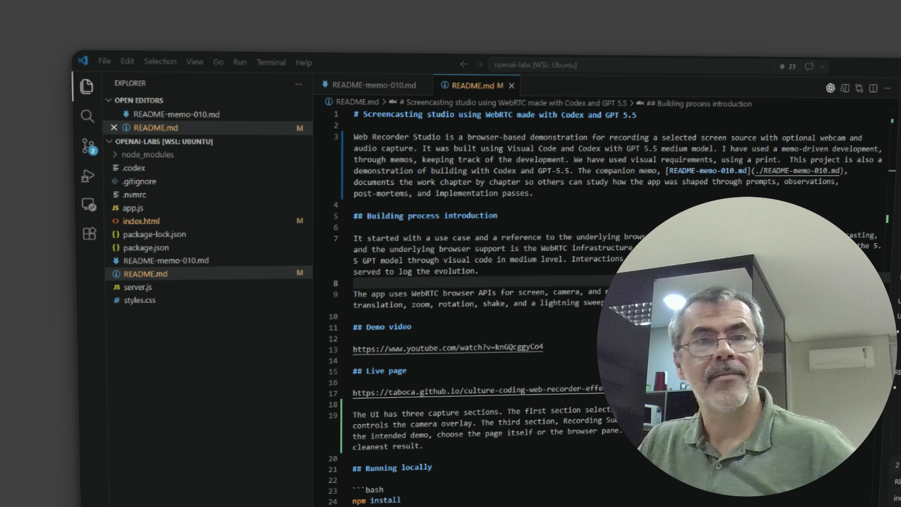

# Screencasting studio using WebRTC made with Codex and GPT 5.5 

Web Recorder Studio is a standalone, browser-based demonstration that enables users to record a selected screen media source, the webcam, and produce a video with a director's viewpoint, including visual effects and camera composition.

This demonstration was created using Codex and GPT 5.5. The goal was to show how existing browser infrastructure, such as WebRTC standards, can now be used in many ways, expanding what can be achieved through creativity and collaboration with modern AI tools.

Philosophically, this demo explores the concept of User Innovation (Eric von Hippel). It was produced in a matter of hours to establish a new perspective on visual storytelling.

The companion memo, [README-memo-010.md](./README-memo-010.md), documents the work chapter by chapter so others can study how the app was shaped through prompts, observations, post-mortems, and implementation passes.

## Building process introduction

It started with a use case and a reference to the underlying browser support. The use case is the need for screencasting, and the underlying browser support is the WebRTC infrastructure. The development started with a Codex session, with the 5.5 GPT model through visual code in medium level. Interactions in the chat produced a memo document and many chapters served to log the evolution.

The app uses WebRTC browser APIs for screen, camera, and microphone capture, plus CSS/JavaScript effects for media panel translation, zoom, rotation, shake, and a lightning sweep.



## Celebration demo video

https://www.youtube.com/watch?v=knGQcggyCo4

## Live page

https://taboca.github.io/culture-coding-web-recorder-effects/

The UI has three capture sections. The first section selects the source shown in the main screen area. The second section controls the camera overlay. The third section, Recording Subject, selects the video source that will be recorded; for the intended demo, choose the page itself or the browser pane. When picking the browser pane, use full screen for the cleanest result.

## Running locally

```bash
npm install
npm run dev
```

Then open `http://localhost:3000`.

## Controls

* `Shift+P` toggles the right control panel.
* `Shift+Click` on the media pane toggles target zoom, translation, and perspective rotation.
* `Shift+E` starts recording or toggles pause/resume.
* `Shift+S` shakes the media pane.
* `Shift+R` rotates the media pane in 3D.
* `Shift+L` triggers a lightning sweep effect.

## References

* WebRTC samples project: https://github.com/webrtc/samples
* Author site: https://mgalli.com

## License

This restored repository is available under the MIT License, copyright 2026 Marcio Galli.

```text
MIT License

Copyright (c) 2026 Marcio Galli

Permission is hereby granted, free of charge, to any person obtaining a copy
of this software and associated documentation files (the "Software"), to deal
in the Software without restriction, including without limitation the rights
to use, copy, modify, merge, publish, distribute, sublicense, and/or sell
copies of the Software, and to permit persons to whom the Software is
furnished to do so, subject to the following conditions:

The above copyright notice and this permission notice shall be included in all
copies or substantial portions of the Software.

THE SOFTWARE IS PROVIDED "AS IS", WITHOUT WARRANTY OF ANY KIND, EXPRESS OR
IMPLIED, INCLUDING BUT NOT LIMITED TO THE WARRANTIES OF MERCHANTABILITY,
FITNESS FOR A PARTICULAR PURPOSE AND NONINFRINGEMENT. IN NO EVENT SHALL THE
AUTHORS OR COPYRIGHT HOLDERS BE LIABLE FOR ANY CLAIM, DAMAGES OR OTHER
LIABILITY, WHETHER IN AN ACTION OF CONTRACT, TORT OR OTHERWISE, ARISING FROM,
OUT OF OR IN CONNECTION WITH THE SOFTWARE OR THE USE OR OTHER DEALINGS IN THE
SOFTWARE.
```
